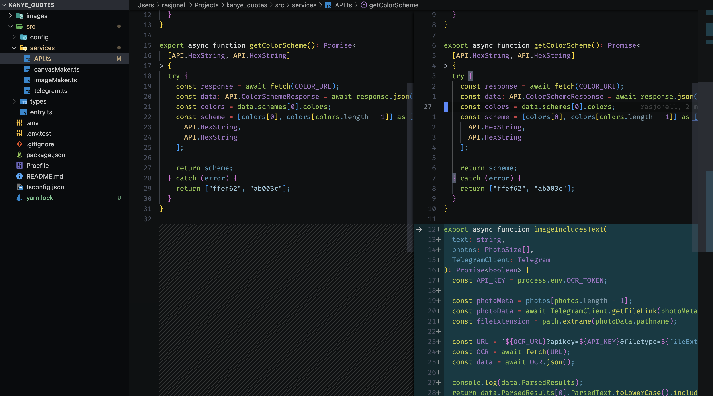

# Vim Ultimum

Make your vim behave exactly like VS Code.



Every now and then developers give `vim` a shot.
They spend a huge amount of time configuring it to behave like a modern editor.
Instead of wasting your precious time writing `~/.vimrc`s just install this one plugin and let it take care of the rest.

## Installation

### Step 1

Remove all of your configs.

```sh
rm ~/.vimrc
touch ~/.vimrc
```

Or if you use `nvim`

```sh
rm ~/.config/nvim/init.vim
touch ~/.config/nvim/init.vim
```

### Step 2

Add `vim-ultimum` to your config.

```vim
Plug 'rasjonell/vim-ultimum'
```

### Step 3

Run `:PlugInstall`

### Step 4

Open up vim and start navigating.

### Step 5

Enjoy your precious time.
